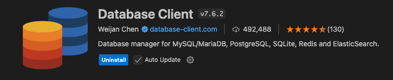

<div align="center">
   <h1 style="display: inline-block; vertical-align: middle; font-size: 32px; font-weight: bold;">
    DEUNA Challenge
  </h1>
</div>

#### This project aims to develop an online payment platform, which will be an API-based application enabling e-commerce businesses to securely and seamlessly process transactions.

## Prerequisites
* Docker: Make sure you have Docker installed on your system.

## How to execute 
1. Clone this repository to your local machine.
2. Open a terminal in the project root and run.
```sh
go mod tidy 
go mod vendor
```
3. Run the following command to build and start the services defined in the ``` docker-compose.yml ``` file:
```sh
make build
```
This will build the Docker images and start the containers.

## Stopping the Application
To stop the application and services, press ```Ctrl+C``` in the terminal where docker-compose up is running. Then, run the following command to stop and remove the containers:
```sh
make down
```


## API Endpoints

### Payment Routes

#### POST /api/v1/payment: Process a payment
* Request Body:
```sh
    {
    "customer_id": "c1",
    "merchant_id": "m1",
    "amount": 110.50,
    "currency": "USD",
    "description": "Payment for product XYZ"
    }
```

#### GET /api/v1/payment/details/:id: Get payment details
* Parameters:
```c
    * id: Payment ID //Take some id from get payments by merchantID to test it.
```

#### GET /api/v1/merchant/:merchantId/payments: List payments for a merchant
* Parameters:
```c
    merchantId: Merchant ID //MerchantsIDs: (Merchant 1: m1) and (Merchant 2: m2) defined in init.sql migration.
```

### Refund Routes

#### POST /api/v1/refund: Process a refund
* Request Body:
```sh
    {
        "payment_id": "string", 
        "reason": "string"
    }
```

#### GET /api/v1/refund/details/:refundId: Get refund details
* Parameters:
```sh
    * refundId: Refund ID
```
#### GET /api/v1/payment/:paymentId/refunds: List refunds for a payment
* Parameters:
```sh
    * paymentId: Payment ID
```
#### Note: All routes are protected by the AuthMiddleware().
* Header: 
```c
    * Authorization: token //You can use the default token for default merchants defined in init.sql migration: 
    //For Merchant 1: token1
    //For Merchant 2: token2
```


## Project Structure
```sh
DEUNA-CHALLENGE/
├── cmd/
│   └── api/
│       └── main.go
├── internal/
│   ├── app/
│   │   └── app.go
│   ├── core/
│   │   ├── models/
│   │   │   ├── payment.go
│   │   │   ├── merchant.go
│   │   │   ├── bank.go
│   │   │   ├── refund.go
│   │   │   └── customer.go
│   │   ├── repositories/
│   │   │   ├── payment_repo.go
│   │   │   └── merchant_repo.go
│   │   └── services/
│   │       ├── payment_service.go
│   │       ├── refund_service.go
│   │       ├── bank_simulator.go
│   │       └── bank_simulator_test.go
│   ├── handlers/
│   │   ├── v1/
│   │   │   ├── payment_handler.go
│   │   │   └── refund_handler.go
│   │   ├── middleware/
│   │   │   ├── auth.go
│   │   │   └── logging.go
│   │   └── routes.go
│   └── database/
│       └── db.go
├── pkg/
│   ├── logger/
│   │   └── logger.go
│   └── errors/
│       └── errors.go
├── config/
│   └── config.go
├── deployments/
│   └── docker/
│       ├── init.sql
│       ├── Dockerfile
│       └── docker-compose.yml
├── .dockerignore
├── .gitignore
├── go.mod
├── go.sum
└── README.md
```

## Additional Considerations/Recomendations
#### If you want to visualize the database in visual studio code, I recommend using the extension “Database Client”.

*  When you install the extension, the database client icon will appear in the vs code sidebar.
    1. Create a new connection
    2. Select PostgreSQL and complete the fields (user, password, DB) with the following credentials defined in the docker compose.
        ```sh 
            - POSTGRES_USER=user
            - POSTGRES_PASSWORD=password
            - POSTGRES_DB=deuna_challenge
        ```
    3. Press connect and you are done, you should be able to see the database tables, as well as the information that is added in the initSQL, you will also be able to see each change you make when you execute a post to create a payment or to make a refund.

## If you have any questions or issues, feel free to open an issue in this repository or contact me.
